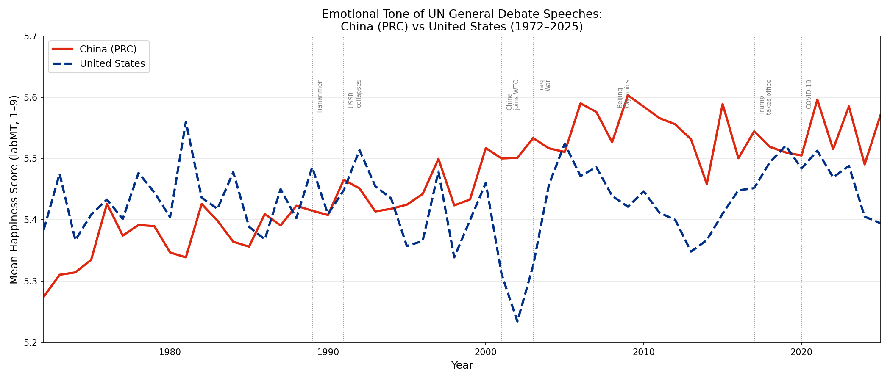
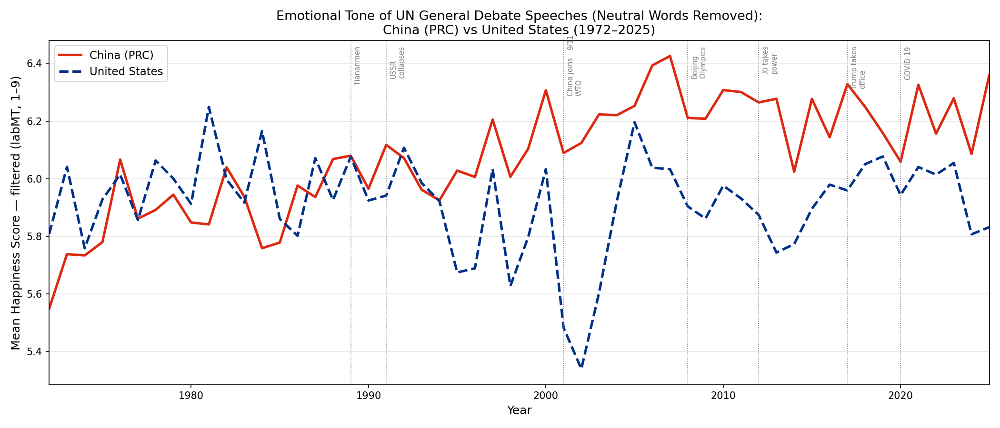

# Emotional Tone of UN General Debate Speeches: China vs USA (1972–2025): Applying the labMT Hedometer

## Project Overview

## Research Question

How has the emotional tone of China's (PRC) UN General Debate speeches evolved since joining the United Nations in 1971, and how does that trajectory compare to the United States over the same period(1971-2025)?

This question matters for Digital Humanities as it uses computational methods to trace how two global superpowers present themselves through language. The UN General Debate is one of the few forums where every country speaks in a comparable format every year. Which makes it the ideal corpus for longitudinal comparison. By applying the labMT hedonometer to 54 years of diplomatic speech, this project asks whether shifts in global power are reflected in change in linguistic tone, and whether a sentiment tool built from American English captures those shifts equally for both countries.

### Relevance

The most interesting finding in this project is that China and the USA swap positions around 2000. before that, the USA scored higher, and after that, China does. This lines up with real world events: China joining the WTO, the Beijing Olympics, Xi Jinping coming to power, while the USA was dealing with 9/11, the Iraq War, and growing political divisions.

This matters for Digital Humanities because it raises a question: can we read shifts in global power through language scores? Especially, considering that the labMT tool was built from American English sources like Twitter and the New York Times. And China's speeches were not originally delivered in English. They were spoken in their native language and then translated into English by UN staff. So what we are actually measuring is a translator's English version of Chinese diplomacy, not the original words. That adds another layer of uncertainty: differences in scores between China and the USA might reflect genuine shifts in tone, the tool's Western bias, or simply differences in how UN translators render Chinese into English.

### Procedure
The corpus was downloaded from Harvard Dataverse (Baturo, Dasandi, Mikhaylov 2017). From the full dataset of over 11,000 speeches from 193 countries, only China (CHN) and the USA were kept. The starting year is 1972,not 1946, because the PRC only joined the UN on October 25, 1971, meaning 1972 is the first full year where China was actually represented as the PRC. Before that, the "CHN" speeches in the corpus were from Taiwan (Republic of China), not mainland China. 

Each speech was scored using the labMT hedonometer by matching words to the lexicon and averaging their happiness scores. The two countries were then plotted as a time series to compare their tone year by year from 1972 to 2025. Looking at the chart, certain jumps and dips were visible and then these were matched to historical moments such as 9/11, the Iraq War, China joining the WTO, the Beijing Olympics, and Xi Jinping coming to power. A bootstrap test with 10,000 iterations was used to check whether the overall difference between the two countries was statistically significant or just noise.

## Corpus and Data Acquisition

### UN General Debate Corpus

To test the research question, UN speeches were collected from the UN General Debate Corpus (UNGDC), created by Baturo, Dasandi, and Mikhaylov (2017) and hosted on Harvard Dataverse. The full corpus contains 11,141 speeches from 193 countries, covering 1946 to 2025. For this project, only China (CHN) and the USA were kept, starting from 1972, leaving 108 speeches in total: 54 per country.

The speeches are stored as plain text files, organised by year and country. Each filename follows the format `CHN_26_1971.txt` (country code, session number, year). The metadata that makes this comparison meaningful is the country code and year, which allows tracking each countries tone over the years.

It is worth noting that speeches were originally delivered in the speaker's native language and then translated into English by UN staff. China's speeches were therefore originally in Mandarin. This means we are measuring a translated version of Chinese diplomacy, which is a limitation discussed further in the reflection section.

**Source:** https://dataverse.harvard.edu/dataset.xhtml?persistentId=doi:10.7910/DVN/0TJX8Y

**Date of access:** April 2026

**Ethics:** The corpus contains only official government statements delivered at a public international forum. No personal data or private information is involved.

**What the source leaves out:** The corpus only includes the annual General Debate speech. not all UN speeches a country makes throughout the year. It also does not capture tone in the original language, only in English translation.

## Measurement

Each speech was scored using the labMT 1.0 lexicon (Dodds et al., 2011), which contains 10,222 English words each rated on a happiness scale from 1 to 9 by workers on Amazon Mechanical Turk. A score of 1 means very negative (like "terrorist" or "death"), 9 means very positive (like "laughter" or "love"), and 5 is neutral.

To score a speech, the following steps were taken:

1. The text was lowercased and split into individual words
2. Each word was looked up in the labMT dictionary
3. Words that matched were averaged together to produce one happiness score for that speech
4. Words that did not match (like proper nouns, technical terms, or very rare words) were simply ignored 

**Coverage** measures what percentage of words in a speech were actually matched to the labMT lexicon. In this corpus, coverage was consistently high — around 90% for both China and the USA, which means the scores are based on the large majority of words in each speech, not just a small sample.

One important note: unlike projects that search for specific emotional words, this project scores the entire speech. The happiness score reflects the overall emotional tone of the language used, not the presence of particular keywords.

**Tokenisation:** no stopwords were removed. Words like "the", "and", "of" are kept because removing them would push scores towards extremes and make short and long speeches harder to compare fairly.

## Key Findings

### Figure 1 — Emotional Tone Over Time

## Results and Figures

### Figure 1 — Emotional Tone Over Time

**China (red line):**
- Starts low (~5.28) in 1972 when the PRC first joined the UN
- Gradually climbs upward over 50 years
- By the 2000s it is consistently higher than the USA
- Generally smoother and more stable year to year

**USA (blue dashed line):**
- Much more volatile — big dips around 2001–2003 (9/11 and the Iraq War) and again after 2017 (Trump era)
- Drops to its lowest point (~5.24) right around the Iraq War in 2003
- Has been trending downward since around 2008

The most interesting pattern is that the two countries swap positions around 2000. Before that, the USA scored higher almost every year. After 2000, China does. This lines up with a period of major geopolitical shifts; China joining the WTO, the Beijing Olympics, Xi Jinping consolidating power; while the USA was dealing with wars, financial crisis, and political polarisation.

It is worth noting that the scores on the y-axis only range from 5.2 to 5.7 — these are small differences on a 1–9 scale. The labMT hedonometer tends to produce scores clustered around 5 for any large body of text, because most common words are neutral. So while the trends are real and statistically significant, the absolute differences are small.

Therefore, I was curious whether removing neutral words would make the differences clearer, so I ran the analysis again with a happiness filter applied

### Figure 2 — Emotional Tone Over Time with tokenization

**Acquisition Pipeline:**

**Raw data:**

**Ethics and Limitations**

**Dataset Characteristics**

The final dataset contained: 

USA UN Speeches:
Chinese UN Speeches:
