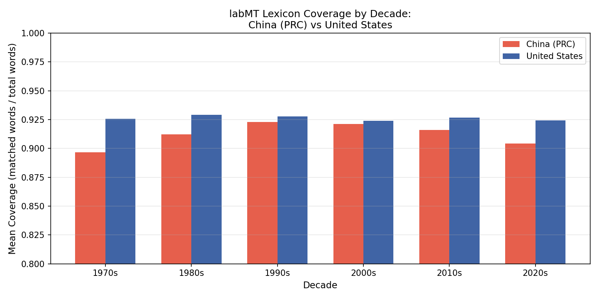
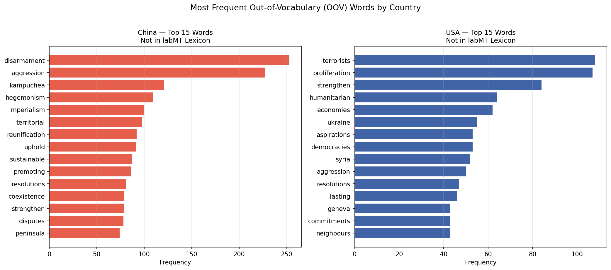
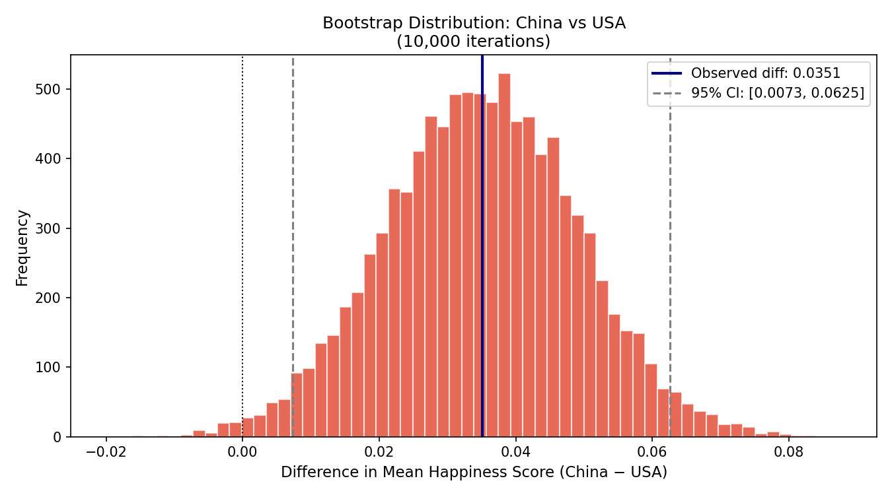
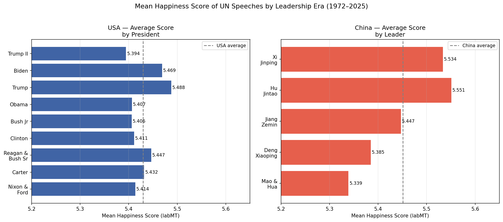

# Emotional Tone of UN General Debate Speeches: People's Republic of China (PRC) vs United States of America (1972–2025): A Digital Humanities Study Applying the labMT Hedonometer

---

## Research Question
This project looks at how emotional language differs between the People's Republic of China and the United States of America by applying the labMT hedonometer to UN General Debate speeches from 1972 to 2025. The central research question asks:

**How has the emotional tone of China's (PRC) UN General Debate speeches evolved since joining the United Nations in 1972, and how does that trajectory compare to the United States over the same period(1972-2025)?**

Additionally, the question is also about the tool itself. The labMT hedonometer was built from American English, drawn from informal sources like Twitter and song lyrics. China's UN speeches are also in English, but a very different type of English. They are translated from Mandarin by UN staff, written in a formal diplomatic register, and built around political vocabulary. By comparing the two countries over 50 years, this project asks not only what the scores show, but also what kinds of language the tool can read and what it cannot. Therefore, the instrument becomes part of the analysis.


## Relevance
Digital Humanities research often uses sentiment analysis without questioning how the tool itself works across different contexts. This project asks a similar basic question: can a happiness lexicon built from contemporary American English actually capture diplomatic English used by a non-Western country? The UN General Debate is one of the few forums where every country speaks in a comparable format every year, which makes it an  good corpus for tracking how nations present themselves over time. China and the USA are especially interesting to compare because the past 50 years have seen a major shift in global power between them.

This matters for Digital Humanities more broadly because computational tools are never neutral. They carry the assumptions of the contexts they were built in. The labMT lexicon was built from American English sources like Twitter, the New York Times, and song lyrics, rated by Mechanical Turk. None of those sources are diplomatic, and none of them are non-Western. By applying this tool to UN speeches, this project does not try to fix that mismatch. It uses the mismatch as part of the analysis, treating what the tool can and cannot read as a meaningful part of the result.

## Main Finding
The central finding is that China and America's UN speeches show no statistically significant difference in average happiness scores, however it does show other things.

The most interesting finding in this project is that China and the USA swap positions around 2000. before that, the USA scored higher, and after that, China does. This lines up with real world events: China joining the WTO, the Beijing Olympics, Xi Jinping coming to power, while the USA was dealing with 9/11, the Iraq War, and growing political divisions.

The clearest pattern is that China and the USA swap positions around 2000. Before that, the USA scored higher. After that, China does. The timing lines up with historical moments. For example: China joining the WTO in 2001, the Beijing Olympics in 2008, and Xi Jinping coming to power in 2012, while the USA has: 9/11, the Iraq War, the 2008 financial crisis, and growing political division. The bootstrap test shows this difference is statistically significant (95% CI: [0.0073, 0.0625]), and the filtered analysis shows the gap actually grows when neutral words are removed.

However,the OOV analysis adds an important layer. What the score is actually picking up on is harder to say. The OOV analysis shows that "aggression", "hegemonism", and "imperialism", which are three of the most frequent words in China's speeches, are not in labMT at all. So China's score is built from the words around its most political vocabulary, not from that vocabulary itself. The rise after 2000 might show us a real change in how China talks at the UN, or it might shows  the fact that China's most confrontational language is exactly what the tool cannot read. With this instrument, those two readings cannot really be separated and thus This means the finding should be read carefully rather than taken at face value.

---

# Corpus and Provenance


## UN General Debate Corpus
The data comes from the UN General Debate Corpus (UNGDC), created by Baturo, Dasandi, and Mikhaylov (2017) and hosted on Harvard Dataverse. The full corpus contains over 11,000 speeches from 193 countries, covering 1946 to 2025. For this project, only China (CHN) and the USA were kept, starting from 1972. The People's Republic of China (PRC) joined the UN on October 25, 1971, meaning 1972 is the first full year where People's Rublic of China was represented. Before that, the "CHN" speeches were in the corpus.

The speeches are stored as plain text files, organised by year and country. Each filename follows the format `CHN_27_1972.txt` (country code, session number, year). The metadata that makes this comparison meaningful is the country code and year, which allows tracking each countries tone over the years.

It is worth noting that speeches were originally delivered in the speaker's native language and then translated into English by UN staff. China's speeches were therefore originally in Mandarin. This means we are measuring a translated version of Chinese diplomacy, which is a limitation discussed further in the reflection section.

**what the corpus leaves out**:
- Only one speech per country per year. The corpus does not include speeches from UN Security Council meetings, committee sessions, or other UN forums
- Speeches were originally delivered in the speaker's native language and translated into English by UN staff. China's speeches were therefore originally in Mandarin

**Source:** https://dataverse.harvard.edu/dataset.xhtml?persistentId=doi:10.7910/DVN/0TJX8Y

**Date of access:** April 2026

**How this corpus differs from the first attempt:** The first project used artwork titles from the Metropolitan Museum of Art API. This project uses political UN speeches from a completely different source, domain, and institution. The comparison here is longitudinal (over time) rather than categorical (Eastern vs Western aesthetic concepts).

### Ethics
The corpus contains only official government statements delivered at a public international forum. No personal data or private information is involved. The corpus is publicly available and free to use for research purposes.

---

## Measurement

### Tokenisation
Each speech was lowercased and split into words using a simple regex pattern (`re.findall(r"[a-z]+"`) that extracts only letter sequences. This removes punctuation, numbers, and special characters automatically. No stopwords were removed.

The filtered analysis (Figure 2) removes words based on their happiness score at a later stage. This is explained under Scoring Choices.

### labMT Matching
Each word was looked up in the labMT 1.0 lexicon (Dodds et al., 2011), which contains 10,222 English words rated on a happiness scale from 1 to 9 by workers on Amazon Mechanical Turk. A score of 1 means very negative (like "terrorist" or "death"), 9 means very positive (like "laughter" or "love"), and 5 is neutral. Words that matched were averaged together to produce one happiness score per speech. Words that did not match were ignored.

### Scoring Choices
Each speech gets one happiness score, which is the average of all the matched words in one speech. Moreover, instead of looking at individual sentences, the whole speech is collapsed into one number. As this project is interested in the overall tone of each country per year, not specific moments within a speech.

One side effect of this is that long speeches with lots of neutral words will always produce scores close to 5. Which is the middle of the labMT scale. This is why the scores in Figure 1 sit between 5.2 and 5.7, even though the speeches are about genuinely emotional topics like war, peace, and geopolitical conflict. I was curious whether this was hiding real differences, so I ran the analysis again but this time removed all words scoring between 4.0 and 6.0. This follows the approach suggested by Dodds et al. (2011) in the original labMT paper. The result is Figure 2 and the pattern becomes clearer.

### Coverage and OOV
Coverage measures the proportion of words in a speech that were successfully matched to the labMT lexicon. China's mean coverage is slightly lower than the USA's across all decades (see Figure 5), which suggests that the tool engages with China's diplomatic vocabulary slightly less well.

#### Figure 5 — labMT Coverage by Decade

> *China (red) consistently has lower coverage than the USA (blue) in every single decade. China's coverage drops in the 2020s to about 0.905, while the USA stays at 0.925. This means more of China's recent speeches contain words the labMT dictionary doesn't recognise.

Additionally, the OOV analysis (see figure 6) reveals something extremely important. China's most frequent missing words are "disarmament", "aggression", "hegemonism", "imperialism". These are not straightforwardly negative in all contexts "disarmament" for example could be framed positively as a peace goal. Additionally the word  However, Without 
access to the surrounding context, we cannot be certain how they would score if 
they were in the labMT dictionary. The same applies to the USA where words such as "terrorists", "proliferation", "humanitarian", "democracies" are all missing too, and these would pull the score in different directions depending on how they were rated. The key point is that both countries' final scores are shaped not just by what the tool can read, but also by what it cannot. Any comparison between the two should be read with this in mind.

#### Figure 6 — Out-of-Vocabulary Words

> *China's missing words are "disarmament" (250+ times), "aggression", "hegemonism", "imperialism". The USA's missing words are "terrorists", "proliferation", "humanitarian" and "democracies".


---

## Results and Figures

The initial corpus contains over 11,000 speeches from 193 countries, covering 1946 to 2025. For this project, only China (CHN) and the USA were kept, starting from 1972.
Therefore, the final dataset contains 108 speeches in total, 54 from China and 54 from the USA, covering every year from 1972 to 2025. After applying the hedonometer, all 108 speeches received a happiness score, since every speech contained at least some words matched in the labMT lexicon. Coverage was high overall, with a mean of 0.915 for China and 0.927 for the USA. No speech had to be excluded from analysis. The figures below visualise the resulting scores in different ways: as a yearly time series (Figure 1), as a filtered version with neutral words removed (Figure 2), as a bootstrap distribution to test for statistical significance (Figure 3), and as averages across leadership eras (Figure 4).


### Figure 1 — Emotional Tone Over Time

> *Mean labMT happiness score per year for China (PRC, red solid line) and the USA (blue dashed line) from 1972 to 2025. Vertical dotted lines mark major geopolitical events. The y-axis is restricted to 5.2 to 5.7 to make differences visible, since labMT scores for long texts tend to cluster near 5.*

One thing you can see in the figure 1 Starts low (~5.28) in 1972 when the PRC first joined the UN, after 50 years is gradually climbs upwards, and by the 2000s is higher than the USA, generally smoother and more stable year to year. In america the figure is much more volatile, with big dips around 2001–2003 (9/11 and the Iraq War) and again after 2017 (Trump). Additionally it drops to its lowest point (~5.24) right around the Iraq War in 2003 and has been trending downward in comparison to china since 2008


After seeing Figure 1, I was curious whether neutral words were flattening the scores. So I ran the analysis again removing all words scoring between 4.0 and 6.0, which only keeps the strong emotionally charged words. The pattern from Figure 1 becomes much clearer here. The gap between China and the USA is more visible, and the USA's dip around 2001–2003 is much more dramatic.

### Figure 2 — Emotional Tone with Neutral Words Removed

> *Mean labMT happiness score per year for China and the USA, with all words scoring between 4.0 and 6.0 removed. Only emotionally charged words contribute to the score. Same time period and event annotations as Figure 1.*

This is a good sign that the pattern is real, but it also changes what the score is measuring. The filtered score is no longer the average emotional weight of the whole speech. It is the average of only the strongly charged words. So Figure 2 tells us that when both countries do use emotional language, China's leans slightly more positive and the USA's leans slightly more negative.


To check whether the overall difference is statistically significant, This project ran a bootstrap test (see figure 3.) with 10,000 iterations. The observed difference is 0.0351 and the 95% confidence interval is [0.0073, 0.0625] 

### Figure 3 — Bootstrap Statistical Test

> *Bootstrap distribution of the difference in mean happiness scores between China and the USA over 10,000 iterations. The red line marks the observed difference (0.0351). Dashed grey lines mark the 95% confidence interval [0.0073, 0.0625]. The dotted line at zero is not inside the interval.*

What statistically significant actually means here is worth being careful about. It means the gap is unlikely to come from random sampling noise. It does not mean the gap is large or important in everyday terms. A difference of 0.035 points on a 1 to 9 scale is small. 

### Figure 4 — Average Score by Leadership Era

> *Mean labMT happiness score per leader, shown as horizontal bar charts. The USA is on the left (blue), China on the right (red). The grey lines mark each country's overall average across 1972 to 2025.*

An additional analysis was used, I broke down the average happiness score by 
leadership era to see if the overall trend holds within each period. For China 
there is a clear upward pattern: Mao and Hua (5.339), Deng Xiaoping (5.385), Jiang Zemin (5.447), Hu Jintao (5.551), Xi Jinping (5.534). Which shows that China's diplomatic tone has become steadily more positive over time.

For the USA the pattern is less consistent. Bush Jr and Obama both score below 
the USA average, while Reagan & Bush Sr score the highest. Trump's first term 
scores relatively high (5.488) while Trump II scores the lowest of all (5.394). 
This also shows the unpredictable nature of US diplomatic tone compared to China's steady rise. It is worth noting that this chart averages across multiple years per leader, which smooths out year-by-year variation, so individual peaks and dips disappear. It also gives the impression that leaders are responsible for the score, when in reality each speech is written by speechwriters and reflects whatever was politically relevant that year. The chart is thus useful for showing that the upward trend in China holds across very different leadership styles, but it should not be read as a ranking of leaders or a measurement of their personal influence on tone.


---

## Critical Reflection and Limitations

1).The biggest limitation of this project is that China's speeches are translations. They were originally delivered in Mandarin and translated into English by UN staff. A diplomat saying something carefully ambiguous in Mandarin can become more positive or more negative depending on how it is rendered in English. This means we are not measuring China's actual word choices, we are measuring a translator's interpretation of them.

2). The tool itself. The labMT lexicon was built from American English sources (Twitter, the New York Times, song lyrics, rated by US-based workers on Mechanical Turk). The OOV analysis shows this clearly: words like "hegemonism" and "disarmament" are central to China's diplomatic vocabulary but completely absent from the lexicon. Crucially, these missing words tend toward confrontational language, meaning China's scores may be slightly inflated relative to what a more complete lexicon would produce.

3). The score differences are small. Even though the difference is statistically significant, the scores only range from about 5.2 to 5.7 on a 1–9 scale. A difference of 0.035 points does not mean China is dramatically more positive than the USA.

4).Finally, this project only looks at one speech per country per year. The UN General Debate speech is an important moment, but it does not represent everything a country says at the UN throughout the year.


---
**What this project does not claim:** It does not claim that China is genuinely happier or more positive than the USA. It does also not claim that language scores measure geopolitical power, or that the labMT score captures the full emotional content of these speeches. It claims only that a measurable, statistically significant difference exists in how the tool reads these two countries UN speeches over time. This difference additionally correlates with known historic geopolitical moments, and that this has to be read alongside what the tool cannot see.


## How to Run

### Repository Structure
```
un-hedonometer/
├── README.md
├── requirements.txt
├── .gitignore
├── src/
│   ├── build_corpus.py
│   ├── score_speeches.py
│   ├── analyse.py
│   ├── analyse_filtered.py
│   ├── bootstrap.py
│   ├── leaders.py
│   ├── coverage.py
│   └── oov.py
├── data/
│   ├── raw/
│   │   ├── speeches_raw/
│   │   └── Data_Set_S1.txt
│   └── processed/
│       └── speeches_scored.csv
└── figures/
```

### Setup

```bash
git clone https://github.com/simonevanmoerkerk-hash/un-hedonometer.git
cd un-hedonometer
python3 -m venv .venv
source .venv/bin/activate  # On Mac/Linux
.venv\Scripts\activate     # On Windows
pip install -r requirements.txt
```


### From Raw Input to Final Output

| Script | Input | Key Output |
|--------|-------|------------|
| `build_corpus.py` | `data/raw/speeches_raw/` | `data/processed/speeches.csv` |
| `score_speeches.py` | `data/processed/speeches.csv` | `data/processed/speeches_scored.csv` |
| `analyse.py` | `data/processed/speeches_scored.csv` | `figures/china_vs_usa.png` |
| `analyse_filtered.py` | `data/processed/speeches.csv` | `figures/china_vs_usa_filtered.png` |
| `bootstrap.py` | `data/processed/speeches_scored.csv` | `figures/bootstrap_china_usa.png` |
| `leaders.py` | `data/processed/speeches_scored.csv` | `figures/china_vs_usa_leaders.png` |
| `coverage.py` | `data/processed/speeches_scored.csv` | `figures/coverage_by_decade.png` |
| `oov.py` | `data/processed/speeches.csv` | `figures/oov_words.png` |

All outputs are saved in `data/processed/` and `figures/`. The pipeline is fully 
reproducible, deleting any output and rerunning the corresponding script 
regenerates it from the original inputs.


---

## Credits and Citation

Dodds, Peter Sheridan, Kameron Decker Harris, Isabel M. Kloumann, Catherine A. Bliss, and Christopher M. Danforth. 2011. "Temporal Patterns of Happiness and Information in a Global Social Network: Hedonometrics and Twitter." Edited by Johan Bollen. PLoS ONE 6 (12): e26752. https://doi.org/10.1371/journal.pone.0026752.
---

## AI Disclosure

During the code construction process, this project made limited use of AI-based tools for support purposes. In early development, this project consulted DeepSeek and gemine to debug code and clarify technical questions. For parts of the Results section, ChatGPT was used to refine phrasing, improve clarity, and structure initial drafts. Throughout drafting and revision, we used the UvA AI assistant to review wording, check coherence, and strengthen academic tone.

All code was revised and verified. We understand the logic and functionality of each script and can explain analytical steps, statistical calculations, and design choices in detail. AI tools were used as writing and debugging support rather than as a substitute for conceptual understanding or interpretive reasoning. All interpretive claims, methodological decisions, and critical reflections represent our own academic judgment and responsibility.